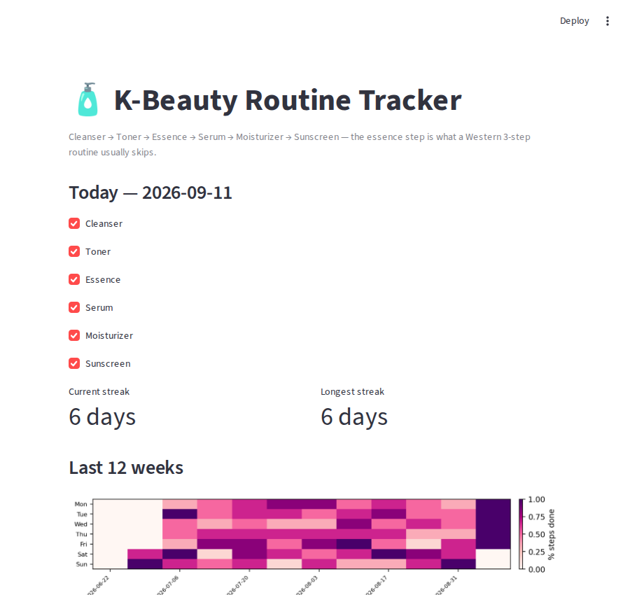

# K-Beauty Routine Tracker

A "habit tracker dashboard," built for my own K-beauty reselling side
project: a Streamlit app that logs a daily 6-step Korean skincare routine
— including the **essence** step, which is what separates a real K-beauty
routine from the shorter Western cleanser-toner-moisturizer version — and
turns the log into a streak count and a 12-week completion heatmap.



## Features

- Daily checklist for all 6 steps (Cleanser, Toner, Essence, Serum,
  Moisturizer, Sunscreen), persisted to SQLite so it survives restarts
- Current-streak logic that doesn't punish you for not having finished
  *today's* routine yet: an unfinished "today" doesn't zero out an
  existing streak, it just isn't counted until it's done, same as how a
  real streak tracker should feel to use
- Separately tracked longest-ever streak, so a broken current streak
  doesn't erase the record
- A 12-week calendar heatmap (Mon–Sun rows, one column per week) showing
  % of steps completed per day at a glance
- All persistence and streak/heatmap math lives in plain, Streamlit-free
  modules (`routine_db.py`, `heatmap.py`) so they're fully unit tested
  without driving a browser

## Tech Stack

Python 3 · Streamlit · SQLite (`sqlite3`) · matplotlib

## Getting Started

```bash
git clone https://github.com/Kazenubis/kbeauty-routine-tracker.git
cd kbeauty-routine-tracker
pip install -r requirements.txt
streamlit run app.py
```

Optional: `python3 seed_demo_data.py` first fills `routine.db` with a few
weeks of sample history, so the heatmap isn't empty on first run.

Run the tests:

```bash
python3 -m unittest test_routine_db.py test_heatmap.py -v
```

## What I Learned

The current-streak function was worth getting exactly right, because the
obvious implementation ("walk back from today, stop at the first
incomplete day") makes the streak show 0 all day, every day, until you've
finished tonight's routine — which is a genuinely annoying way for a habit
tracker to behave. The fix was to only skip *today* specifically if it's
incomplete, and start counting from yesterday instead, so the number
shown reflects what you've actually built rather than punishing you for
not being done yet. I wrote a specific test for that case
(`test_incomplete_today_does_not_zero_out_an_existing_streak`) since it's
exactly the kind of off-by-one that's easy to get backwards.
